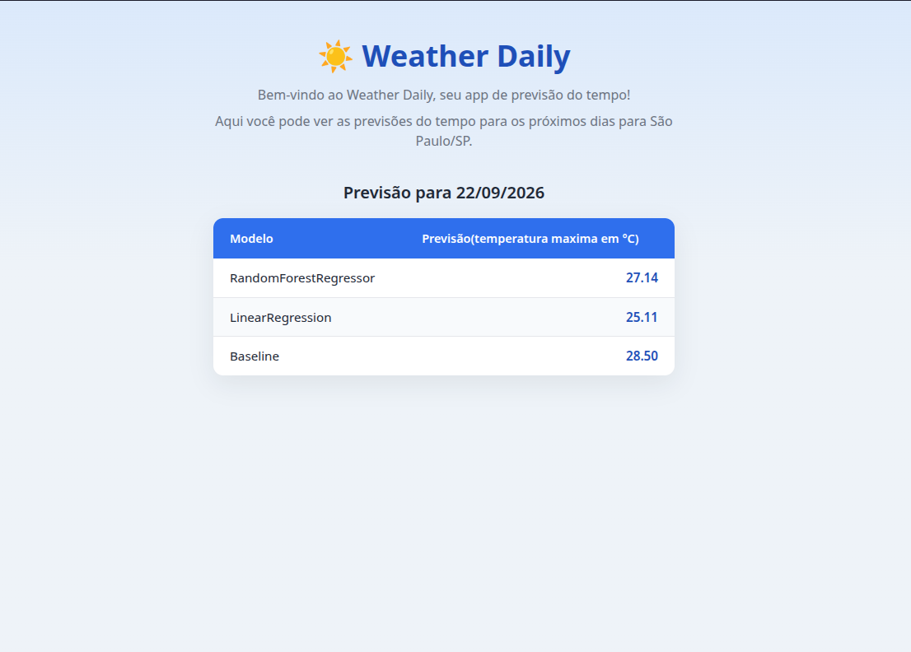

# weather_daly

**Português** | [English](README_EN.md)

Terminei o pipeline preditivo do clima: previsão da temperatura máxima do dia seguinte a partir do clima de hoje, com coleta via Interface de Programação de Aplicações (API) pública, PostgreSQL (window functions pra feature engineering) e dois modelos do scikit-learn avaliados contra um baseline de persistência. Depois virou também um webapp simples mostrando a previsão mais recente.

## Resultado

RandomForestRegressor ficou com o menor erro: erro absoluto médio (MAE) de 2,17°C, contra 2,19°C da regressão linear e 2,30°C do baseline (usar a temperatura de hoje como previsão de amanhã, sem modelo nenhum). Os dois modelos batem o baseline, mas por pouco: uns 6%. Com só quatro variáveis do dia de hoje, é o que dá pra tirar, e é um número honesto.

Dados: 2021-01-01 até hoje, coordenadas de São Paulo (-23.5505, -46.6333). A coleta busca a data mais recente disponível na Open-Meteo dinamicamente, sem data fixa cravada no código. Corte treino/teste em 2024-01-01, respeitando ordem cronológica, sem shuffle, porque é série temporal.

## Correção: vazamento de dado (o número antigo estava errado)

A primeira versão deste README dizia MAE de **1,84°C** pro RandomForest e 2,02°C pra regressão linear, batendo o baseline por 20%. Esse número não era real.

A view `weather_features` cria quatro colunas com `LEAD()`: `temp_max_dia_seguinte` (o target) e também `temp_min_dia_seguinte`, `precipitacao_dia_seguinte` e `velocidade_vento_dia_seguinte`. O `split_train_test` só tirava o target das features, então as outras três entravam no treino. Ou seja: o modelo usava a temperatura mínima, a chuva e o vento **de amanhã** pra prever a máxima **de amanhã**. Isso é vazamento de dado: informação que não existe no momento da previsão.

A correção tira das features toda coluna que termina em `_dia_seguinte` (só o target fica, como `y`). Resultado honesto:

| Modelo | MAE com vazamento | MAE corrigido |
|---|---|---|
| RandomForestRegressor | 1,84°C | **2,17°C** |
| LinearRegression | 2,02°C | **2,19°C** |
| Baseline (persistência) | 2,30°C | 2,30°C |

O RandomForest também ganhou `random_state=42`, pra que o número seja reproduzível entre execuções.

## Limitação

Isso ainda não é previsão do tempo de um dia realmente desconhecido: é comparação retrospectiva (backtesting). `load_features` só aceita dias em que o `temp_max_dia_seguinte` já é conhecido, então todo dia que o pipeline "prevê" já tem o resultado real gravado no banco. É assim que dá pra calcular o MAE.

Com o vazamento corrigido, o caminho pra prever um dia genuinamente futuro ficou aberto: as features agora são só do dia de hoje, então basta pegar o dia mais recente sem exigir target, montar a linha de features dele e rodar `model.predict()`. Antes da correção isso nem seria possível, porque o modelo dependia de colunas que só existem amanhã. Esse foi, aliás, o sintoma que devia ter me alertado antes.

## Pipeline

1. Coleta os dados históricos direto da Open-Meteo Archive API (sem chave, sem cadastro).
2. Carrega em `weather_daily` via upsert (`ON CONFLICT ... DO UPDATE`) — idempotente, rodar de novo não duplica nem quebra.
3. Explora com agregações nativas do Postgres (`STDDEV`, `CORR`, `EXTRACT`) direto no `psql`, sem passar pelo pandas.
4. Monta as features em `weather_features`, uma view com `LEAD()` pro target (temperatura de amanhã) e uma média móvel de 3 dias via `AVG() OVER (... ROWS BETWEEN 2 PRECEDING AND CURRENT ROW)`.
5. Separa treino/teste por data, remove das features toda coluna do dia seguinte (só o target fica), treina e avalia (MAE) `LinearRegression` e `RandomForestRegressor`, comparando os dois contra o baseline.
6. Grava cada previsão em `model_predictions` (data, modelo, valor real, valor previsto) — dá pra refazer a comparação inteira via Structured Query Language (SQL) pura depois, sem precisar do pandas.

## Webapp

Página simples (Flask + Jinja2, renderizado no servidor, sem JavaScript) mostrando a previsão mais recente direto do banco, pros três modelos lado a lado.

## Setup

Ver [`docs/SETUP.md`](docs/SETUP.md) — Postgres via Docker e cheat sheet do `uv`.

## Estrutura

| Caminho | O quê | Fase correspondente no roteiro |
|---|---|---|
| `sql/schema.sql` | Data Definition Language (DDL) de `weather_daily` | 00 |
| `src/weather_daly/ingestion.py` | `fetch_weather_data` | 01 |
| `src/weather_daly/storage.py` | `load_to_postgres` (upsert), `ingest_results` (grava previsões), `get_latest_predictions` | 02, 08 |
| `sql/exploration.sql` | queries exploratórias | 03 |
| `sql/features_view.sql` | view com window functions | 04 |
| `src/weather_daly/modeling.py` | `load_features`, `split_train_test`, `baseline_predict`, `train_and_evaluate` | 05, 06, 07 |
| `sql/predictions_schema.sql` | DDL de `model_predictions` | 08 |
| `src/weather_daly/main.py` | orquestra o pipeline inteiro, ponta a ponta | — |
| `app.py` | webapp Flask, rota `/` renderiza a previsão mais recente | — |
| `templates/index.html` | template Jinja2 da página | — |
| `assets/css/styles.css` | estilo da página | — |

## Próximos passos

- Agendar (cron ou systemd timer) o `main.py` rodando sozinho todo dia, sem depender do meu PC.
- Previsão de um dia genuinamente futuro, não só backtesting (ver Limitação acima).
- Hospedar em algum lugar que rode Python de verdade (Render, Railway) — GitHub Pages só serve estático, não roda Flask nem fala com Postgres.
